There are a multitude of ways to deploy a simple HTML website to the internet these days. I will have a list of services at the end of this post but, for this post, we will look at doing that using [Amazon S3](https://aws.amazon.com/s3/). As with all services, the first step is to [create an account](https://portal.aws.amazon.com/gp/aws/developer/registration/index.html). Once you have your accounts and are signed in, click on services:

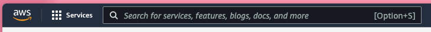

This will expand to a mega-menu of all of the services offered on AWS. In here look for the storage link and click on it to show the submenu.

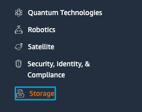

In the submenu you will see an entry for S3. Go ahead and click on the link:

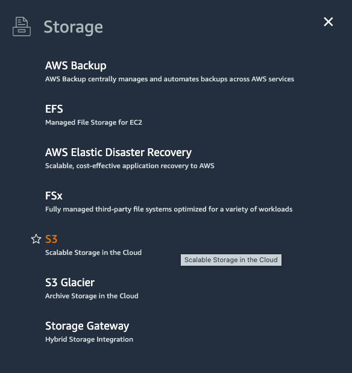

S3 uses a concept called objects which are stored in buckets. From the [Amazon S3 documentation](https://docs.aws.amazon.com/AmazonS3/latest/userguide/Welcome.html#CoreConcepts):

> Amazon S3 is an object storage service that stores data as objects within buckets. An object is a file and any metadata that describes the file. A bucket is a container for objects.

We therefore need to create a bucket to store our objects (files) in. To do this, click on the Create Bucket button:

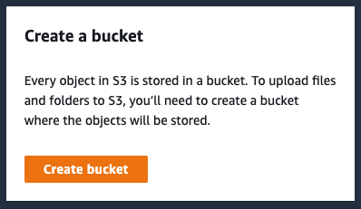

Give your bucket a name. For now, we will leave the rest of the settings at their default values. Click the `Create bucket` button at the bottom of the page.

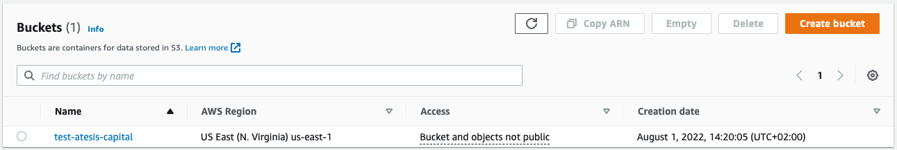

In the header of the page you should also see a banner similar to the following:

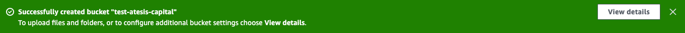

The message would be something similar to the following:

> Successfully created bucket "test-html-website"
> To upload files and folders, or to configure additional bucket settings choose View details.

Go ahead and click the "View details" link. You will now be presented with a page listing all the objects currently in the bucket. At the moment, out bucket is still empty.

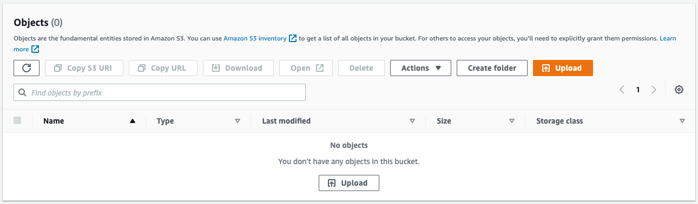

Let’s upload some files to the bucket. Click the "Upload" button. On the next page you can upload individual files or an entire folder. You can either click on the appropriate button or just drag and drop files and folders.

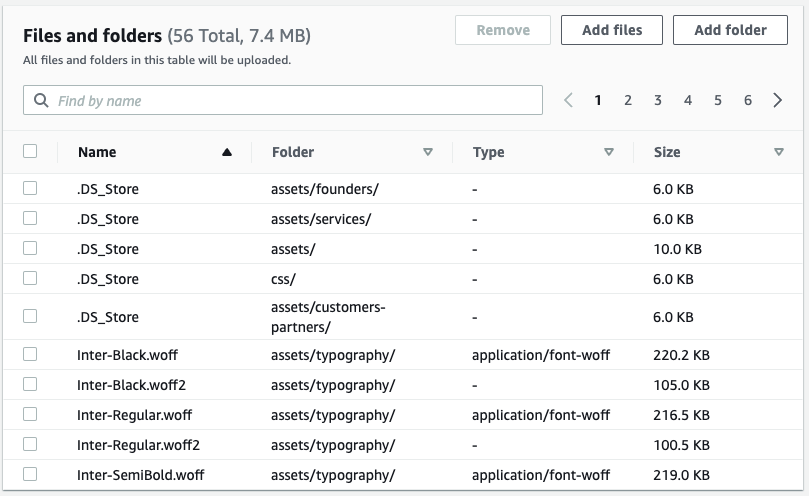

If you dragged and dropped a number of files and folders, you may find that it has also included hidden files such as `.DS_Store`. Nothing has been uploaded yet so, you can go ahead and select any files you will not need and click the "Remove" button to remove them from the list.

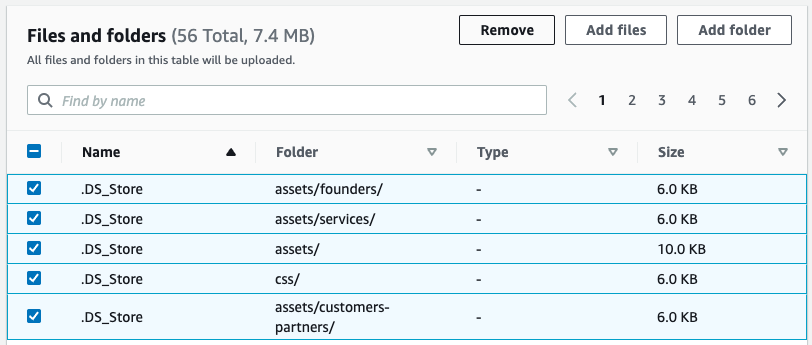

Once you are happy with the remaining list of files and folders, click the upload button. This will start the upload progress. You will see a in page notice area showing you the progress of your uploads. If everything is successful, you will see a success message. Your file and folder list will now be updated with a status of "succeeded" next to each successfully uploaded file.

## Enable website hosting

Now that we have uploaded all our assets, let’s enable our bucket to be used as a website. At the top off all pages you will find a breadcrumb link list similar to the following:

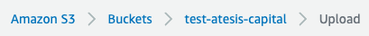

Go ahead and click on the buckets link. From the list click on our bucket again, and click the properties link on the next page. Scroll right to the bottom of the page where you will find a block titled, "Static website hosting".

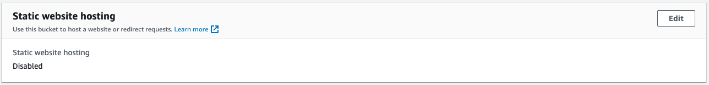

We want to enable this feature so, go ahead and click on the "Edit" button. On the resulting page, click on the "Enable" radio button.

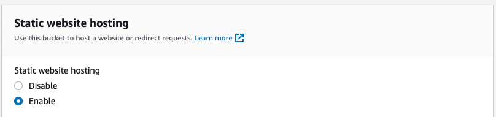

The form will expand to reveal a number of additional configuration options. Leave the hosting type as, "Host a static website", and enter a document that will be the default page served by the server. This is commonly called `index.html` but could really be anything.

> NOTE: The filename is case-sensitive.

If you have a document you want to be served to users should an error occur, you can enter that in the next field. If you do _not_ specify a document, Amazon S3 will return a default error document.

> NOTE: You can also specify redirection rules here. This is beyond the scope of this post but, you can read more about it on the [Amazon AWS website](https://docs.aws.amazon.com/AmazonS3/latest/userguide/how-to-page-redirect.html#advanced-conditional-redirects).

Once you are satisifed with the configuration, click the "Save changes" button. The page will reload and should show a success message at the top of the page. Scroll to the bottom of the page again and take note of the URL shown under the "Bucket website endpoint" heading. This is the URL at which you can access the contents from your bucket.

## Configure index document and set permissions

The URL will not work just yet, we still need to configure your index document and set permissions. We already uploaded an index document earlier so, the only steps left are setting permissions. Scroll back to the top of the page, and click on the permissions tab. Here you want to click the edit button for the "Block public access (bucket settings)" block.

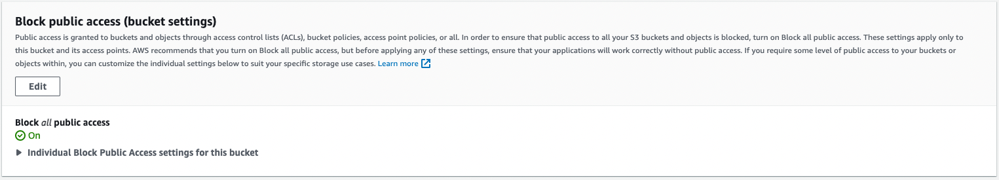

The block will expand to show a tree list of checkboxes with the first option, "Block all public access", checked. To enable public access, you want to uncheck this option.

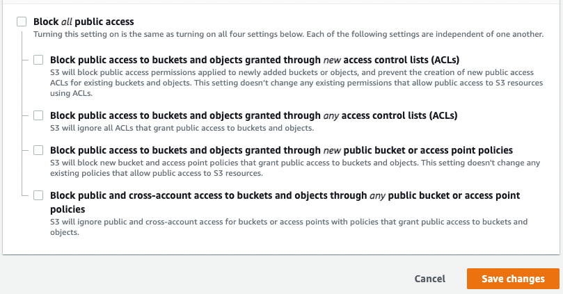

> When reading the documentation, Amazon twice in the same section mentions that when you enable public access like this, you need to review the ["Blocking public access to your Amazon S3 storage"](https://docs.aws.amazon.com/AmazonS3/latest/userguide/access-control-block-public-access.html) docs so you are aware of the risks.

If you are happy to proceed, click the "Save changes" button. Once you click this, a dialog will pop up with the following message:

> Updating the Block Public Access settings for this bucket will affect this bucket and all objects within. This may result in some objects becoming public.

Again, if you are OK with this step, type in "confirm" and click the "Confirm" button. Your change will be saved and the page will reload. Next we need to add a bucket policy. This is to make the objects in your bucket publicly readable. Amazon provides an example policy here with a caveat that it allows "full access to the contents of your bucket". If you are not entirely sure if this is what you want, you can read the ["How can I secure the files in my Amazon S3 bucket?"](https://aws.amazon.com/premiumsupport/knowledge-center/secure-s3-resources/) docs.

If you are happy to use the provided example, you can copy and paste the following into the bucket policy input bocks on the permissions tab from before. First click the edit button and ten paste the code into the editor. Note that you need to replace `Bucket-Name` with the name of your bucket. Click on the save changes button.

The page will reload and there will now be a little indicator that shows that your bucket is now publicly accessible. At this point my webpage and all the assets loaded successfully without any problems but, you might also want to look at using [object access control lists](https://docs.aws.amazon.com/AmazonS3/latest/userguide/WebsiteAccessPermissionsReqd.html#object-acl).

In a separate post I will look at doing the same, but this time use [AWS Amplify](https://docs.aws.amazon.com/amplify/latest/userguide/getting-started.html).

### Further reading

- [Logging web traffic](https://docs.aws.amazon.com/AmazonS3/latest/userguide/LoggingWebsiteTraffic.html)
- [Configuring a webpage redirect](https://docs.aws.amazon.com/AmazonS3/latest/userguide/how-to-page-redirect.html)
