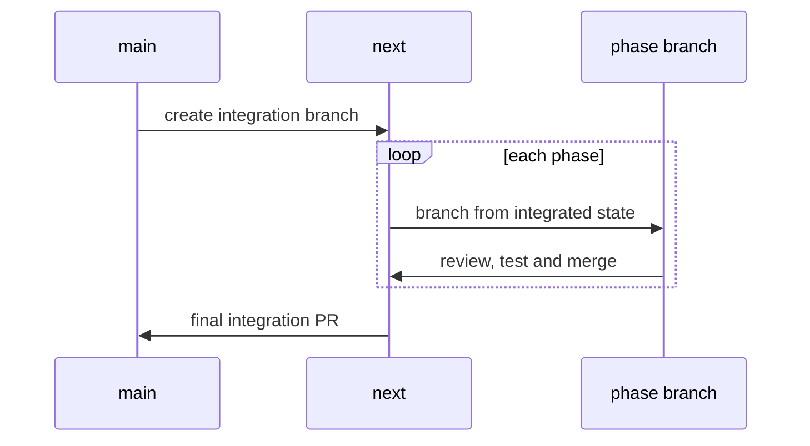
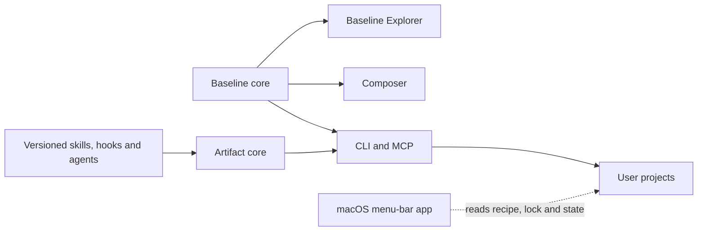

I thought I was going to add versioning to Calavera's agent skills.

That sentence now feels almost comically small.

By the time [Calavera 2.3.0](https://github.com/schalkneethling/create-project-calavera/releases/tag/v2.3.0)
reached npm, the project had become a pnpm monorepo with independent release boundaries, a
[Baseline](https://developer.mozilla.org/en-US/docs/Glossary/Baseline/Compatibility) Target Explorer,
package-backed skills, hooks and agents, a Tauri menu-bar application for macOS that reports available
artifact updates, a shared artifact resolver, a shared Baseline engine, and a publication pipeline
built around
[npm trusted publishing](https://docs.npmjs.com/trusted-publishers/) and signed provenance.

Not all of those surfaces shipped together. The menu-bar application lives in the repository and I run
it against my own projects, but it is not part of this release and there is no build to download yet.

In summary, what reached npm was eighteen versioned public packages, with signed provenance for every
package. However, you are not here for the summary, but for the details in the middle.

## The Idea Kept Growing

The original idea was clear, and it came from Mistral's work on giving prompts and skills
[a system of record in AI Studio](https://mistral.ai/news/manage-prompts-and-skills-in-studio/).
Studio treats each prompt and skill as a tracked asset with immutable versions, a named owner and an
audit trail, so a team can change one of them, compare it against what shipped, and roll it back
without disturbing everything else. Calavera had the opposite arrangement. It bundled useful skills,
hooks and an agent, but their lifecycle was tied to the CLI, so updating one meant releasing
everything. A manifest, catalog and lockfile could give each artifact its own identity and version.

Mistral solves this for an enterprise platform, where the assets live inside the system that runs
them. Calavera is a command-line tool that writes into projects it does not own, so the same idea had
to arrive through npm, a lockfile and content hashes rather than a central registry. A similar
problem, but Calavera requires a different implementation.

Then I found what else that idea required.

If artifacts were independently published, the repository needed real package boundaries. If those
boundaries existed, shared Baseline recommendation logic should not live inside one UI. If projects
could hold exact artifact versions, users needed status, doctor, migration and targeted update
commands. If updates became independently available, a read-only menu-bar application could notify
people without modifying their projects.

The implementation plan grew into seven phases:

1. Define architecture and public contracts.
2. Convert the repository into a monorepo without changing behavior.
3. Build the Baseline MVP.
4. Extract independently versioned artifacts.
5. Add the package-backed artifact lifecycle.
6. Build the optional macOS menu-bar application.
7. Rehearse the combined release journey.

The plan was coherent, but reviewing it as one pull request would have been reckless. The first
important decision was therefore not architectural. It was about how to make the work reviewable.

## Stacking The Phases On A `next` Branch

I created `next` from `main`, then stacked branches in dependency order. Each branch targeted `next`.
After it merged, I merged `next` into the following branch before opening that branch for review.

That produced a repeating cycle:



Each new phase started from the integrated result of the phases before it. Every phase could therefore
be reviewed and tested as a bounded change, while `next` always held the complete result so far.
`main` stayed stable until the whole system had been exercised.

This also created a place for manual testing. For a change this large, "the tests pass" was
necessary but nowhere near sufficient. I wanted to switch between increments, use the applications,
inspect generated files, try dry runs, edit managed files deliberately, and confirm cleanup behavior.

The stacked branches made that possible without leaving the final merge as a large set of unrelated
changes to review at once.

## Move First, Then Change

The monorepo phase changed no behavior. Every commit in it was a file move, a path update, or a
configuration change to keep the existing tests passing.

The existing CLI and MCP server moved into `packages/cli`. The Composer moved into `apps/composer`.
Empty boundaries were established for the Baseline Explorer, menu-bar app, shared Baseline code,
artifact infrastructure, and the eventual artifact packages.

For readers who have not seen Calavera's repository, the important relationships now look like this:



The applications can deploy independently. The shared packages contain reusable domain behavior.
The CLI remains the only surface in this diagram that installs tooling into a project; the menu-bar
application never writes to a project at all. As noted above, it did not ship with this release. It
is in the repository, I run it against my own projects, and it stays there until it is ready for a
release build.

The public package name, commands, binaries, schema URL and Composer behavior were preserved. The CI
workflows now test, build, pack and release each workspace package independently.
[Changesets](https://github.com/changesets/changesets) was configured for independent versions rather
than one synchronized monorepo number.

That separation mattered later. When failures appeared, I could tell whether they belonged to the
repository move, a product capability, or the release system. Mixing all three would have made every
diagnosis harder. The fewer variables involved in each failure, the easier it was to find the actual
cause.

## Baseline Proved The Boundaries Worked

The Baseline Target Explorer was the first feature built entirely on the new package boundaries, and
the first evidence that they held.

`@schalkneethling/calavera-baseline-core` consumes pinned
[WebDX](https://github.com/web-platform-dx/web-features) data, generates a deterministic CSS-focused
snapshot, and exposes pure recommendation functions. The Explorer can explain Widely, Newly and
fixed-year Baseline targets or recommend the earliest target for a set of CSS features. It turns the
same decision into browser versions, a Stylelint rule, Stylelint configuration and a Calavera recipe.

The CLI, Composer, MCP and WebMCP all consume the same recommendation model. That parity was a release
contract, not an aspiration.

The test suite already covers the pinned data cutoff, moving and fixed targets, approximate dates,
Limited availability, earliest-target recommendations, browser mappings, generated Stylelint rules,
recipe options, schema validation, MCP results and browser keyboard behavior. Sharing an
implementation is helpful, but it is not enough evidence by itself. I opened
[#358](https://github.com/schalkneethling/create-project-calavera/issues/358) to turn representative
recommendations into an explicit fixture matrix across every public surface.

Dogfooding also raised a broader product question. An agent may be better served by deterministic CLI
commands for project work, while MCP concentrates on discovery and natural-language questions such
as "Which linters support TypeScript?" I recorded that CLI/MCP/WebMCP responsibility review in
[#354](https://github.com/schalkneethling/create-project-calavera/issues/354) rather than changing the
public tools as part of a release article.

The Explorer's own interface received the same attention. Its output controls now follow the
[WAI-ARIA Authoring Practices tabs pattern](https://www.w3.org/WAI/ARIA/apg/patterns/tabs/), with the
keyboard behavior covered in Playwright rather than assumed.

The Baseline work also exposed a data problem. Reproducible builds need a pinned time boundary.
Deriving "current year" from the system clock made identical source inputs produce different snapshots.
The generator now uses a checked-in snapshot year and cutoff date, and rejects future data.

## An Artifact Is Not A Dependency

The artifact work made a deliberate distinction between distributing an artifact and installing a
project dependency.

Calavera now publishes each maintained skill, hook and agent as its own npm package. A package carries
one payload and one `calavera-artifact.json` manifest. The manifest declares stable identity, type,
payload path, supported targets when applicable, and compatible CLI range.

Consumer projects do not gain those packages in `package.json` or `node_modules`. Calavera resolves
registry metadata and tarballs, verifies npm integrity, package identity, manifest compatibility and
payload hashes, then installs the managed output into the project. Exact resolutions live in
`.calavera/artifacts.lock.json`, which records what package version should be installed. Installed
hashes and ownership remain in `.calavera/state.json`, which records what Calavera may safely update
or remove.

The dedicated manifest already does four things that would otherwise be spread across the repository.
It separates artifact identity from npm package identity, validates hook and agent targets, declares
CLI compatibility, and gives catalog generation and payload verification one contract. I did consider
moving some of that data into `package.json`, and decided against it. An artifact recorded there would
look like an ordinary dependency to everything that reads a manifest, so dependency automation such as
Dependabot would raise pull requests to bump artifacts that Calavera alone is supposed to install,
verify and track. Two systems would then claim the same versions, and the lockfile would stop being
the single answer to what a project has installed.

That decision leaves a real gap. Because artifacts sit outside `package.json`, nothing in the usual
dependency tooling tells a developer that a newer version exists, and the only surface that reports it
today is the menu-bar application, which runs on macOS. Only exposing this support to one operating
system is not okay, and not everyone wants to install another application that potentially adds to
their push notification fatigue.

So the notification belongs in the CLI, where every user already is. Most of the machinery is there.
`artifacts status --check-updates` reports each installed version alongside the latest one and whether
an update is available, and `artifacts update` applies a new version for a single artifact or for all
of them, with a dry run and release channels available.

What is missing is the part a person reads. The useful detail only appears with `--json`. The
human-readable output reports little more than completion, links to nothing, and does not print the
command that would apply the update. The engine is correct and the interface is hiding it, which is a
failure I hit again during the release rehearsal below. Making that status report readable, linking
each outdated artifact to its release notes on GitHub, and offering the update command inline is
[#398](https://github.com/schalkneethling/create-project-calavera/issues/398).

That separation made several promises possible:

- ordinary `apply` uses exact locked versions;
- only an explicit artifact update advances a version;
- status remains offline unless update checking is requested;
- verified cached tarballs support locked offline installs;
- local edits block unsafe overwrites;
- one artifact can update without moving the CLI or another artifact.

Hooks exposed a subtle version of the same problem. A hook is not only its script; it can also
create a settings fragment that sits alongside the script. Both paths have to participate in
ownership, dry-run reporting, state tracking and cleanup. Treating that fragment as incidental would
have made status report the wrong result and left cleanup incomplete.

## The UI Can Be Newer Than The Package

During the work, a user reported `stylelint-logical-css` drift: the hosted Composer and schema offered
an integration that the published CLI did not know how to apply.

The catalog fix was simple. The cause was not. The Composer deploys as a static application and the
CLI ships as an npm package, so the interface a user sees can be newer than the tool that has to
apply the recipe.

Calavera now gives post-`2.2` integrations a minimum CLI version. The Composer filters choices against
the published CLI rather than assuming that whatever exists in its source tree is already available
to every user.

That is a pattern I will reuse: when two surfaces deploy independently, compatibility needs to be
represented in data, not implied.

## What The Manual Rehearsal Found

The release rehearsal ran in small increments.

I started with a minimal recipe in a temporary project, previewed it, applied it, inspected
`.editorconfig`, `package.json` and managed state, then applied it again. The second application
normalized an obsolete state field; the third was byte-for-byte stable.

I removed the integration and exercised cleanup in three modes:

- dry run reported the planned deletion;
- a local edit changed the result to a protected skip;
- restoring the managed content allowed safe removal.

That small workflow caught a human-output bug: JSON dry-run output listed the deletion, but the
human-readable result only said that nothing had been removed. The code was doing the right thing and
the interface was hiding it. I fixed the message and added a regression test.

The same care applied beyond that small fixture:

- updating one artifact had to change only that artifact's exact lock entry;
- a corrupt or mismatched tarball had to fail before any project file changed;
- a missing or locally edited hook settings fragment had to make artifact status unhealthy;
- Explorer tabs had to support Arrow, Home, End, Enter and Space in a real browser;
- the menu-bar app had to copy the update command even when a preferred terminal could not be opened.

That last one has a short design history behind it. The first version of the menu-bar application
would have opened the default macOS terminal, which is the right answer only for the people who use
it. I do not: I work in Warp, and an update flow that launched Terminal instead would have been a
small irritation every single time. So the preferred terminal became something a developer
configures, and once it is set, the application can open that terminal with the update command
already typed. Even that is not reliably correct, because the terminal may open somewhere other than
the project the update applies to.

So every path ends the same way, with the command on the clipboard. Copying is the one outcome that
holds regardless of which terminal a developer prefers, where it opens, or whether it opens at all.
The configured terminal is a convenience layered on top of that, never a requirement.

A release checklist is most valuable when it describes what a person should observe, not merely which
command should exit zero. This is also the kind of care I wrote about in
[Do we no longer care about the code?](https://schalkneethling.com/posts/do-we-no-longer-care-about-the-code/):
understanding and testing the system well enough to find where it is wrong, where it falls short, or
where a technically correct result still creates a poor experience.

## Respecting A Contributor's Open Pull Request

Before merging `next`, there was an older contributor pull request from Theo Ephraim adding Varlock
support.

Dropping a rearchitecture onto a contributor's branch is an easy way to turn a generous contribution
into unpaid migration work. We first offered help and waited. After three days, we brought the change
into `next` ourselves while preserving Theo's authorship and credit.

The generated GitHub release notes later credited Theo as a new contributor. Architecture is not only
about code boundaries. It is also about making change survivable for the people around a project.

## The Release Pipeline Had Its Own Release

The integrated code passed review and rehearsal. Publishing still took four prereleases.

### Before `next.0`: Automation Could Not Open The Version PR

Changesets generated the version commit and pushed `changeset-release/main`, then GitHub rejected the
attempt to create a pull request. Repository Actions were not allowed to create PRs.

The workflow had already done the versioning work correctly; the failure happened at the GitHub API
boundary. In the repository's Actions settings, I enabled the permission that allows GitHub Actions
to create pull requests. The fix was a repository setting, not a broader workflow token or a
personal-access token. Once that setting was enabled, the same release automation could create its
reviewable version PR normally.

### `next.0`: The Package Artifact Did Not Exist Where CI Expected It

The build packed successfully, but the upload step looked for `package/*.tgz` and found nothing.
Packing and uploading used different destination assumptions.

I fixed the workflow so every public package group packs into the same `package` directory consumed
by the artifact upload. `scripts/check-release-contracts.mjs` now asserts that the pack destination
and `actions/upload-artifact` path agree, so a future drift fails during ordinary repository checks
instead of after a release is published.

### `next.1`: The Packed Manifest Failed Provenance Verification

The new packages needed to exist on npm before trusted publishers could be configured for them. I
used a tightly scoped bootstrap path for the first candidate, then encountered a provenance failure
on the Baseline package because the repository metadata inside its packed manifest was not
acceptable to npm's source verification.

The useful word there is _packed_. The source `package.json` is not the final evidence. I inspected
the actual archive:

```bash
tar -xOf \
  package/schalkneethling-calavera-baseline-core-0.2.0-next.1.tgz \
  package/package.json
```

That exposed the metadata npm was evaluating. I corrected the canonical repository URL and monorepo
directory, then extended the release contract so every public package must declare repository
metadata that matches its workspace. The check became deterministic before I produced another
candidate.

### `next.2`: Bootstrap Succeeded

All eighteen packages published. That let me configure npm trusted publishing for all seventeen new
packages; the primary Calavera CLI has already been configured.

Then I removed the token fallback from the workflow, deleted the GitHub environment secret, revoked
the npm token, and tightened npm publishing access. The bootstrap credential existed for one publish
and was then removed.

Configuring the same trusted publisher by hand across seventeen packages is time I would most like
back, and there is tooling for it. I come back to that at the end.

One caution before I do. Any tool that bootstraps a trusted publisher does so by claiming the package
name first, and those placeholders should only ever stand in for real packages that are ready to
follow promptly. Using empty packages to reserve speculative names would create a separate npm policy
concern. This is commonly referred to as name-squatting. Please do not do it.

### `next.3`: Prove OIDC, Do Not Assume It

The final candidate published all eighteen packages through OIDC alone. Each package received signed
provenance. I verified the `next` dist-tags, installed the exact CLI, checked package metadata and
confirmed there was no hidden token fallback.

Only then did I consider stable promotion.

## Even The Stable Version PR Needed Review

Exiting Changesets prerelease mode should have produced eighteen stable package updates. An isolated
simulation showed two extra changes:

- Composer gained `"version": null` and a changelog;
- the private menu-bar app moved from `0.1.0` to `0.1.1` and gained a changelog.

Both applications were private and excluded from Changesets. An exit-mode edge case still pulled them
into the generated plan.

I did not edit the real release directly. I reproduced the behavior in a disposable copy, changed
only `.changeset/pre.json` in the promotion PR, then removed the four private-app files from the
automated stable version PR. After that correction, the diff contained exactly the intended public
packages and nothing else.

This was a useful final reminder: generated release PRs are code. Review them.

## The Stable Release

On the exact merge commit I ran:

- a frozen-lockfile install;
- the complete release rehearsal;
- the pinned workflow security audit;
- Changesets status;
- a clean pack of all eighteen packages;
- embedded manifest inspection;
- an exact-version npm absence check;
- a consumer-side `2.3.0` CLI smoke test.

The GitHub release began as a draft targeting the recorded commit. I verified the tag, title, notes,
target, and that the release was marked stable rather than prerelease, before publishing it.

The resulting workflow kept test, build and publish in separate jobs. The build job produced and
uploaded the tarballs. The protected publish job downloaded those artifacts, requested its OIDC
identity, rejected registry failures that were not explicit missing-version responses, and published
the packages.

Afterward I verified all eighteen `latest` tags, confirmed every `next` tag still pointed to
`next.3`, checked eighteen provenance statements, resolved the stable CLI from npm, and ran it outside
the workspace.

Then I cleaned up the temporary tarballs and confirmed the worktree was clean.

I typed most of that verification by hand more than once before this point, and the friction of doing
so is what prompted the question: could this be a CLI that is deterministic, reliable and repeatable?
It could. The pack inventory, embedded-manifest checks, exact-version registry probes, dist-tag
comparison, provenance count and cleanup are part of Calavera now, and they are what ran for this
release.

What they are not yet is portable. Every one of those checks is deterministic, and none of them is
specific to this project.
[#357](https://github.com/schalkneethling/create-project-calavera/issues/357) is about lifting them
out into something any project can use, and then having Calavera consume that tool like any other
consumer would.

## The Tool I Wish I Had Found Sooner

I learned about Fledgling after completing this release. It focuses on exactly the awkward bootstrap
loop I handled manually: claiming new npm package names, configuring OIDC trusted publishers, and
reconciling that configuration across a monorepo.

For Calavera, it could have claimed the seventeen new package names with minimal placeholders,
configured each one against the same GitHub workflow and protected `publish` environment, and then
been rerun idempotently as each package was published. Its `sync` flow would also have given me a useful
feedback loop before removing the bootstrap token and again before the token-free `next.3` candidate:
show the actual npm trust configuration, compare it with the repository's intended configuration,
apply only approved differences, then require a no-drift result.

It would not have found the missing tarball upload, the packed provenance metadata problem, the
GitHub Actions PR permission, or the Changesets private-app edge case. Those remain independent
release gates. Fledgling would have made one fragile part of the journey easier; it would not have
made the rest of the rehearsal unnecessary.

I have since adopted it, with the constraints this release taught me to value: pin and review the tool
version, inspect its plan first, keep a human confirmation before it claims names or changes trust,
avoid moving `latest` with a placeholder unintentionally, and keep Changesets, package inspection,
provenance and registry verification as separate evidence.

## What I Will Carry Into The Next Release

The biggest lesson is that a release is a product workflow. It has users, interfaces, failure states,
security boundaries and recovery semantics.

More concretely:

1. **Break architecture into reviewable transitions.** Stacked branches made a large change
   understandable without hiding the integrated result.
2. **Model deployment timing explicitly.** A shared repository does not make a hosted UI and an npm
   package appear simultaneously.
3. **Inspect the thing you publish.** Tarballs, generated version PRs and release metadata are better
   evidence than source intent.
4. **Treat manual testing as design feedback.** The clean dry-run bug was not a logic failure. It was
   an observability failure.
5. **Use prereleases to test the release system.** `next.0` through `next.3` were not wasted versions;
   they were progressively stronger evidence.
6. **Remove bootstrap credentials, do not merely stop using them.** The npm token existed for one
   publish. The release was only safe once it had been revoked, its environment secret deleted, and
   its fallback removed from the workflow.
7. **Make retry safe.** Exact-version checks let a partial multi-package publish resume without
   unpublishing good packages.
8. **Pause before irreversible actions.** Draft releases, explicit approvals and one-step gates kept
   the process inspectable.

I have turned that process into the `release-with-confidence` agent skill. The commands will change
from project to project. The discipline should not.

Calavera 2.3.0 is live. It is almost an entirely new architecture, but it still serves the original
goal: make project tooling choices explicit, inspectable and repeatable.

That applies to releases too.

## Further Reading

- [Your Prompts and Skills need a system of record](https://mistral.ai/news/manage-prompts-and-skills-in-studio/) — Mistral on versioning prompts and skills in AI Studio
- [Calavera 2.3.0 release notes](https://github.com/schalkneethling/create-project-calavera/releases/tag/v2.3.0)
- [Baseline (compatibility) on MDN Web Docs](https://developer.mozilla.org/en-US/docs/Glossary/Baseline/Compatibility)
- [The `web-features` dataset maintained by the W3C WebDX Community Group](https://github.com/web-platform-dx/web-features)
- [Trusted publishing for npm packages](https://docs.npmjs.com/trusted-publishers/)
- [Changesets](https://github.com/changesets/changesets)
- [Fledgling](https://github.com/dmno-dev/fledgling)
- [WAI-ARIA Authoring Practices: tabs pattern](https://www.w3.org/WAI/ARIA/apg/patterns/tabs/)
